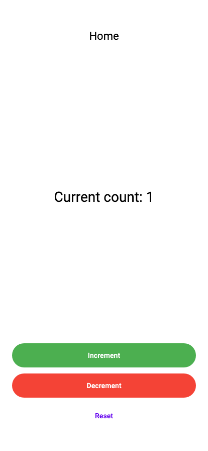
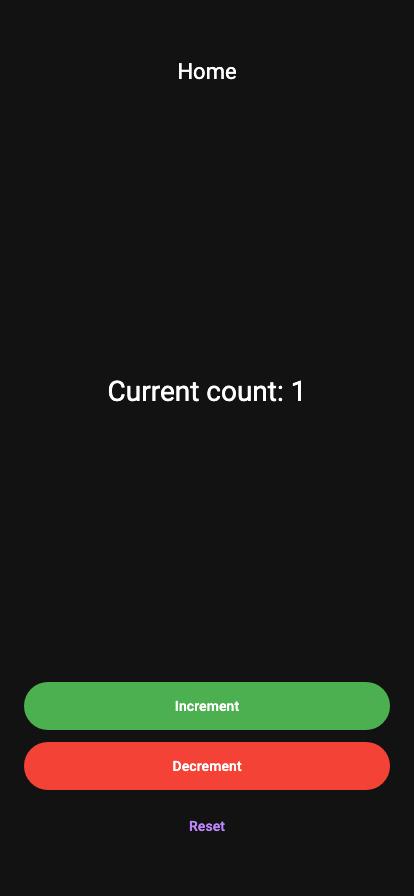

<strong>EPIC</strong>:
home

As a user, I want to be able to navigate the home screen so that I can access app features.

<strong>STORY</strong>:
counter

As a user, I want to be able to view and interact with the counter feature.

<strong>FEATURE</strong>:
initialize

Initializing the counter

<strong>AC</strong>:
success

When a user navigates to the home page, the app attempts to read the saved counter value and initializes the counter to that value.

## initial state

<table>
  <tbody>
   <tr>
      <td width="300" style="vertical-align:top">
<b>Expect:</b>
<ul>
  <li>Counter should initialize to saved value (1) if read is successful</li>
</ul>
<b>Events:</b>
<ul>
  <li class=info>[app_builder] INFO: locale: en</li>
  <li class=analytic>[ANALYTIC] [page]: Home_Route</li>
  <li>Counter_Event_Initialize</li>
      </td>
      <td>
            </td>      </td>
      <td>
            </td>   </tr>
  </tbody>
</table>
