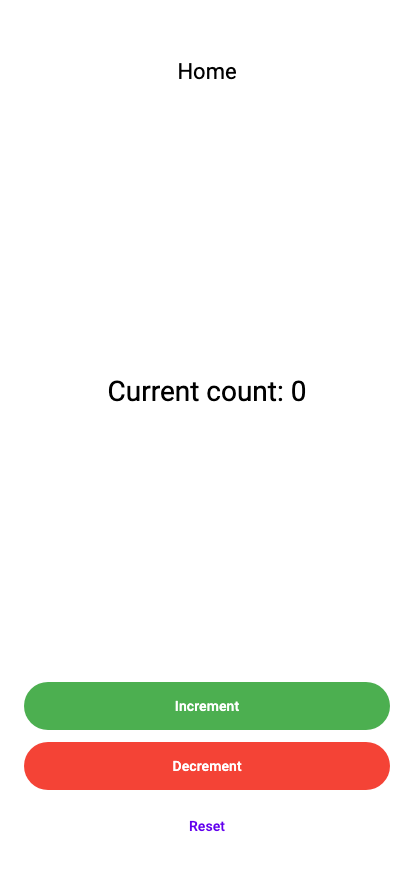
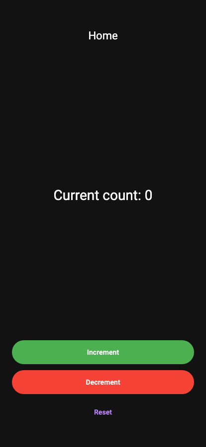

<strong>EPIC</strong>:
home

As a user, I want to be able to navigate the home screen so that I can access app features.

<strong>STORY</strong>:
counter

As a user, I want to be able to view and interact with the counter feature.

<strong>FEATURE</strong>:
reset

Resetting the counter

<strong>AC</strong>:
failure_to_save

When the user taps the reset button, the counter value resets to zero, but there is a failure to save the new value.

## initial state

<table>
  <tbody>
   <tr>
      <td width="300" style="vertical-align:top">
      </td>
      <td>
            </td>      </td>
      <td>
            </td>   </tr>
  </tbody>
</table>
## tap reset button

<table>
  <tbody>
   <tr>
      <td width="300" style="vertical-align:top">
<b>User Actions:</b>
<ul>
  <li>Tapped: widget with type "Home_Button_Reset"</li>
</ul>
<b>Expect:</b>
<ul>
  <li>Counter should reset to 0, even if save fails</li>
</ul>
<b>Events:</b>
<ul>
  <li>Counter_Event_Reset</li>
  <li class=warning>[counter_bloc] WARNING: Failed to save home/counter value</li>
      </td>
      <td>
            </td>      </td>
      <td>
            </td>   </tr>
  </tbody>
</table>
